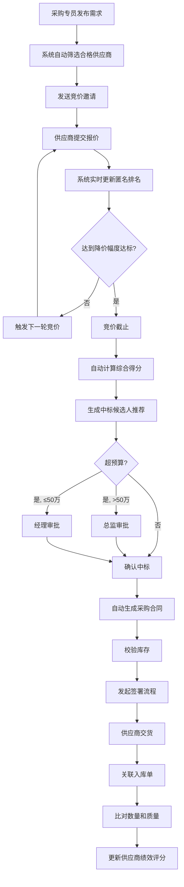

# 企业级供应商竞价与反向拍卖自动化管理系统 - PRD

## 1. 产品概述

企业级供应商竞价与反向拍卖自动化管理系统，专为大型企业采购部门设计，实现从需求发布、供应商筛选、多轮竞价、智能评标、合同生成到履约评估的全流程自动化。系统支持上千供应商同时竞价的高并发场景，通过自动化流程大幅提升采购效率，降低采购成本，确保采购过程透明合规。

**核心价值**：
- 自动化供应商资质筛选与智能评标，降低人为干预
- 实时多轮反向拍卖机制，最大化降价幅度透明可追溯
- 全流程数字化管理，合规审计无忧
- 数据驱动决策，持续优化采购策略

## 2. 核心功能

### 2.1 用户角色

| 角色 | 注册方式 | 核心权限 |
|------|---------|---------|
| 采购专员 | 企业SSO登录 | 发布竞价需求、管理供应商库、查看竞价过程 |
| 采购总监 | 企业SSO登录 | 审批超预算项目、查看全局报表 |
| 供应商 | 注册审核通过 | 参与竞价、查看竞价结果、管理企业信息 |
| 系统管理员 | 企业SSO登录 | 系统配置、用户管理、日志审计 |

### 2.2 功能模块

1. **采购需求管理**：需求发布、资质要求设置、起拍价设置、截止时间设置
2. **供应商库管理**：供应商信息维护、资质等级管理、绩效评分管理
3. **智能竞价引擎**：多轮竞价、实时匿名排名、降价幅度控制、竞价截止
4. **智能评标系统**：得分自动计算、中标候选人推荐、超预算审批
5. **合同管理**：合同自动生成、库存校验、电子签署流程
6. **履约管理**：入库关联、数量质量比对、绩效评分更新
7. **报告中心**：月度统计报告、趋势图表、PDF/Excel导出
8. **历史查询**：多维度组合查询、批量导出
9. **系统管理**：操作日志、异常预警、企业群推送

### 2.3 页面详情

| 页面名称 | 模块名称 | 功能描述 |
|-----------|---------|----------|
| 采购需求列表 | 需求管理 | 查看/编辑/发布需求 |
| 新建竞价需求 | 需求管理 | 填写需求详情、设置资质要求、起拍价、截止时间 |
| 供应商库 | 供应商管理 | 搜索、筛选、查看供应商详情、绩效 |
| 竞价大厅 | 竞价管理 | 实时查看竞价进度、匿名排名、触发下一轮 |
| 供应商报价页 | 竞价管理 | 提交报价、查看历史报价、查看当前排名 |
| 评标结果 | 评标管理 | 查看得分详情、中标候选人推荐 |
| 审批中心 | 审批管理 | 超预算项目多级审批 |
| 合同管理 | 合同管理 | 合同草稿、签署流程、合同归档 |
| 履约管理 | 履约管理 | 入库单关联、质量检验、绩效更新 |
| 报告中心 | 报告管理 | 月度报告、趋势图表、导出 |
| 历史记录查询 | 查询管理 | 多维度查询、批量导出 |
| 系统日志 | 系统管理 | 操作日志、异常预警记录 |

## 3. 核心流程

## 4. 用户界面设计

### 4.1 设计风格

- **主色调**：深蓝色系，体现专业、可信赖
  - 主色：`#1E40AF`
  - 辅色：`#3B82F6`
  - 成功色：`#059669`
  - 警告色：`#D97706`
  - 危险色：`#DC2626`

- **字体**：
  - 标题：思源黑体 Bold
  - 正文：Inter 400

- **按钮风格**：
  - 主按钮：圆角8px，悬停阴影
  - 次按钮：边框样式，悬停背景色

- **布局风格**：
  - 顶部导航栏 + 左侧菜单 + 主内容区
  - 卡片式布局，信息层级清晰
  - 数据表格支持筛选、排序、分页

- **图标风格**：
  - 使用线性图标，统一风格
  - 关键操作图标突出显示

### 4.2 页面设计概述

| 页面名称 | 模块名称 | UI元素 |
|-----------|---------|--------|
| 竞价大厅 | 实时竞价 | 倒计时、匿名排名榜、报价曲线图表、操作按钮 |
| 报告中心 | 数据可视化 | 柱状图、折线图、数据卡片、导出按钮 |
| 评标结果 | 得分详情 | 雷达图、得分表格、推荐排名 |

### 4.3 响应式设计

- 桌面端优先设计
- 支持平板设备自适应
- 关键操作区域触控优化

## 5. 核心业务规则

### 5.1 竞价规则

- **降价幅度要求：每轮报价必须低于当前最低价的至少2%
- **竞价轮次：最多5轮，每轮30分钟
- **匿名规则：仅显示供应商自身报价和排名，不显示竞争对手名称
- **截止规则：到达截止时间或连续2轮无有效报价自动截止

### 5.2 评分规则

- **价格权重**：70%（价格越低得分越高）
- **历史评分**：30%（过往履约质量、交货及时性等综合评分
- **中标规则：综合得分最高者中标

### 5.3 审批规则

- **超预算10%以内：采购经理审批
- **超预算10%-30%：采购总监审批
- **超预算>50万：必须总监审批

### 5.4 绩效评分维度

- 价格竞争力（30%）
- 产品质量（30%）
- 交货及时性（20%）
- 服务响应（20%）
