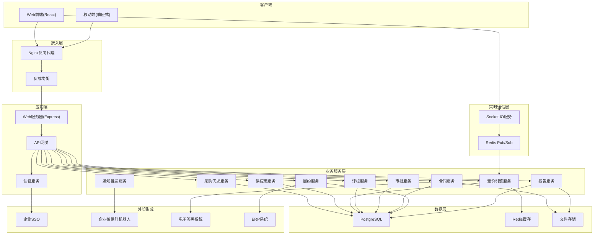
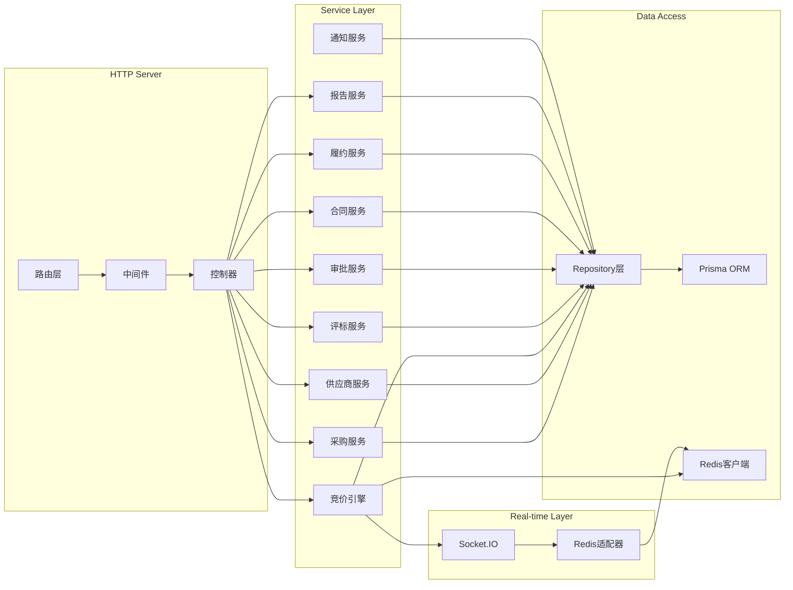
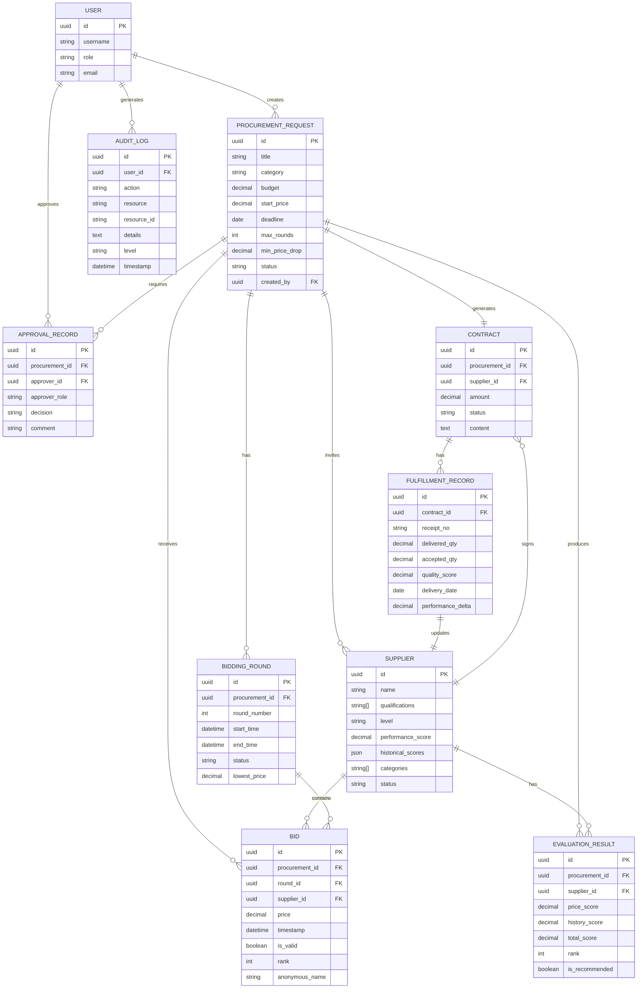

# 企业级供应商竞价与反向拍卖自动化管理系统 - 技术架构

## 1. 架构设计



## 2. 技术描述

### 2.1 前端技术栈
- **框架**: React 18 + TypeScript
- **构建工具**: Vite 5
- **样式**: TailwindCSS 3
- **状态管理**: Zustand
- **路由**: React Router DOM 6
- **图表**: Recharts 2
- **UI组件**: Radix UI + Lucide React
- **实时通信**: Socket.IO Client
- **HTTP客户端**: Axios
- **日期处理**: date-fns

### 2.2 后端技术栈
- **运行时**: Node.js 20
- **框架**: Express 4
- **语言**: TypeScript
- **实时通信**: Socket.IO 4
- **ORM**: Prisma 5
- **缓存**: Redis + ioredis
- **认证**: JWT + bcrypt
- **API文档**: Swagger/OpenAPI
- **任务调度**: node-cron

### 2.3 数据库
- **主数据库**: PostgreSQL 15
- **缓存/会话**: Redis 7
- **开发环境**: SQLite（快速原型开发）

### 2.4 报告生成
- **PDF生成**: PDFKit
- **Excel生成**: ExcelJS
- **图表渲染**: Chart.js Node版

### 2.5 高并发架构要点
1. **Redis分布式锁**: 防止并发报价冲突
2. **连接池优化**: PostgreSQL连接池配置
3. **内存缓存**: 竞价排名实时数据内存缓存
4. **批量写入**: 操作日志批量异步写入
5. **水平扩展**: Socket.IO多节点 + Redis适配器

## 3. 路由定义

| 路由 | 权限 | 页面 |
|------|------|------|
| `/login` | 公开 | 登录页 |
| `/dashboard` | 认证用户 | 数据概览 |
| `/procurement` | 采购专员/总监 | 采购需求列表 |
| `/procurement/new` | 采购专员 | 新建竞价需求 |
| `/procurement/:id` | 相关人员 | 需求详情/竞价大厅 |
| `/suppliers` | 采购专员/总监 | 供应商库 |
| `/suppliers/:id` | 相关人员 | 供应商详情 |
| `/bidding` | 供应商 | 我的竞价 |
| `/bidding/:id` | 供应商 | 报价页面 |
| `/evaluation/:id` | 采购专员/总监 | 评标结果 |
| `/approvals` | 审批人 | 审批中心 |
| `/contracts` | 相关人员 | 合同管理 |
| `/fulfillment` | 采购专员 | 履约管理 |
| `/reports` | 管理层 | 报告中心 |
| `/history` | 认证用户 | 历史查询 |
| `/admin/logs` | 管理员 | 系统日志 |
| `/admin/settings` | 管理员 | 系统设置 |

## 4. API 定义

### 4.1 核心类型定义

```typescript
// 供应商
interface Supplier {
  id: string;
  name: string;
  qualification: string[];
  level: 'A' | 'B' | 'C' | 'D';
  performanceScore: number;
  historicalScores: {
    price: number;
    quality: number;
    delivery: number;
    service: number;
  };
  status: 'active' | 'inactive' | 'suspended';
  categories: string[];
  createdAt: Date;
}

// 采购需求
interface ProcurementRequest {
  id: string;
  title: string;
  description: string;
  category: string;
  quantity: number;
  unit: string;
  budget: number;
  startPrice: number;
  requiredQualifications: string[];
  minSupplierLevel: 'A' | 'B' | 'C' | 'D';
  deadline: Date;
  maxRounds: number;
  minPriceDrop: number;
  status: 'draft' | 'published' | 'bidding' | 'evaluating' | 'approved' | 'rejected' | 'awarded' | 'completed';
  createdBy: string;
  createdAt: Date;
}

// 竞价轮次
interface BiddingRound {
  id: string;
  procurementId: string;
  roundNumber: number;
  startTime: Date;
  endTime: Date;
  status: 'active' | 'ended';
  lowestPrice: number;
}

// 供应商报价
interface Bid {
  id: string;
  procurementId: string;
  roundId: string;
  supplierId: string;
  price: number;
  timestamp: Date;
  isValid: boolean;
  rank: number;
  anonymousName: string;
}

// 评标结果
interface EvaluationResult {
  id: string;
  procurementId: string;
  supplierId: string;
  priceScore: number;
  historyScore: number;
  totalScore: number;
  rank: number;
  isRecommended: boolean;
}

// 审批记录
interface ApprovalRecord {
  id: string;
  procurementId: string;
  approverId: string;
  approverRole: string;
  decision: 'approved' | 'rejected';
  comment: string;
  createdAt: Date;
}

// 合同
interface Contract {
  id: string;
  procurementId: string;
  supplierId: string;
  amount: number;
  status: 'draft' | 'signing' | 'signed' | 'executing' | 'completed';
  content: string;
  signedAt?: Date;
}

// 履约记录
interface FulfillmentRecord {
  id: string;
  contractId: string;
  receiptNo: string;
  deliveredQuantity: number;
  acceptedQuantity: number;
  qualityScore: number;
  deliveryDate: Date;
  performanceDelta: number;
}

// 系统日志
interface AuditLog {
  id: string;
  userId: string;
  action: string;
  resource: string;
  resourceId: string;
  details: string;
  ip: string;
  timestamp: Date;
  level: 'info' | 'warning' | 'error';
}

// 月度报告
interface MonthlyReport {
  id: string;
  month: string;
  totalProjects: number;
  avgPriceDrop: number;
  awardDeviationRate: number;
  totalSavings: number;
  comparisonData: {
    currentMonth: Record<string, number>;
    lastMonth: Record<string, number>;
  };
  generatedAt: Date;
}
```

### 4.2 主要API端点

| 方法 | 路径 | 描述 |
|------|------|------|
| POST | `/api/auth/login` | 用户登录 |
| GET | `/api/procurements` | 获取采购需求列表 |
| POST | `/api/procurements` | 创建采购需求 |
| POST | `/api/procurements/:id/publish` | 发布需求并筛选供应商 |
| GET | `/api/procurements/:id/bidding` | 获取竞价实时数据 |
| POST | `/api/bids` | 提交报价 |
| GET | `/api/procurements/:id/evaluation` | 获取评标结果 |
| POST | `/api/approvals/:id/decide` | 审批决策 |
| POST | `/api/contracts/:id/generate` | 生成合同草稿 |
| POST | `/api/fulfillments/receive` | 登记收货 |
| GET | `/api/reports/monthly/:month` | 获取月度报告 |
| POST | `/api/reports/monthly/:month/export` | 导出月度报告 |
| GET | `/api/history/search` | 历史记录组合查询 |
| POST | `/api/history/export` | 批量导出 |
| GET | `/api/admin/logs` | 获取系统日志 |

## 5. 服务器架构图



## 6. 数据模型

### 6.1 ER图



### 6.2 关键索引优化

```sql
-- 竞价查询优化
CREATE INDEX idx_bids_procurement_round ON bids(procurement_id, round_id);
CREATE INDEX idx_bids_supplier_procurement ON bids(supplier_id, procurement_id);
CREATE INDEX idx_bids_price ON bids(price DESC);

-- 供应商筛选优化
CREATE INDEX idx_suppliers_categories ON suppliers USING GIN(categories);
CREATE INDEX idx_suppliers_qualifications ON suppliers USING GIN(qualifications);
CREATE INDEX idx_suppliers_level_status ON suppliers(level, status);

-- 报告查询优化
CREATE INDEX idx_procurements_status_created ON procurements(status, created_at);
CREATE INDEX idx_fulfillments_contract_date ON fulfillments(contract_id, delivery_date);

-- 日志查询优化
CREATE INDEX idx_audit_logs_timestamp ON audit_logs(timestamp DESC);
CREATE INDEX idx_audit_logs_user_action ON audit_logs(user_id, action);
```
